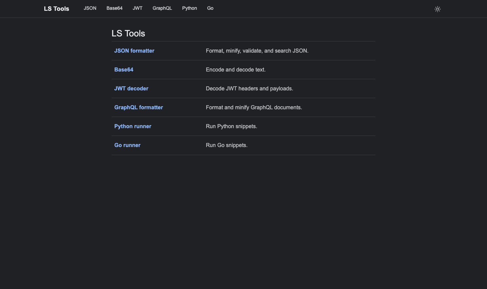
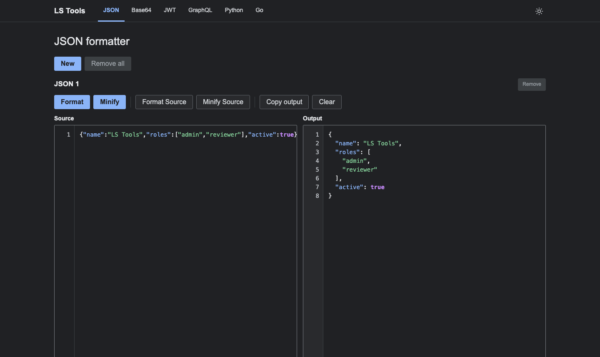
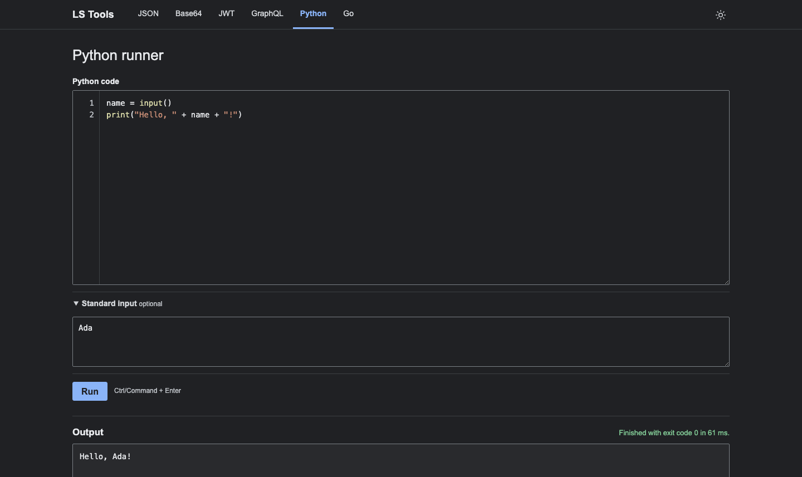
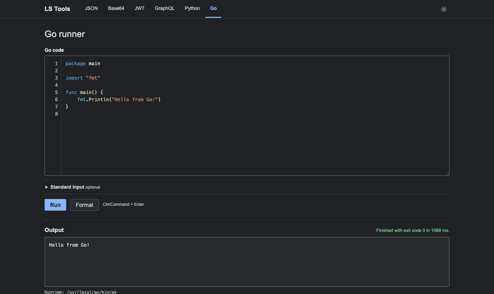
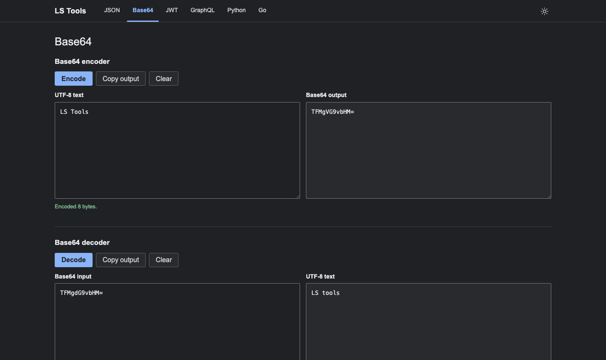
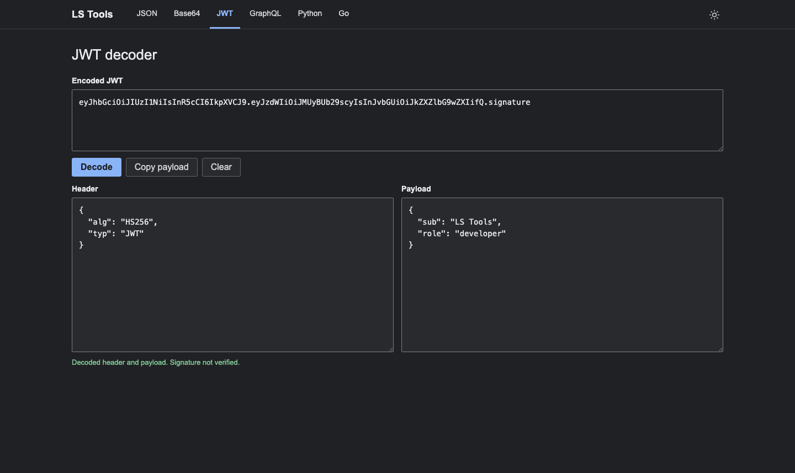

# LS Tools

LS Tools is a small, local-first toolbox for formatting data, inspecting JWT tokens, and running short Python or Go snippets. It is a dependency-free Go web application: the Go standard library serves an embedded browser UI, while the browser performs the data transformations that do not need an operating-system process.

The project is deliberately compact. A running instance listens only on `127.0.0.1:8787` and uses the tools already installed on the local machine.

## What it provides

| Tool | Main operations | Where the work happens |
| --- | --- | --- |
| JSON formatter | Format, minify, validate, syntax-highlight, find, replace, and maintain up to ten workspaces | Browser JavaScript |
| Base64 | Encode UTF-8 text and decode strict Base64 into UTF-8 text | Browser JavaScript |
| JWT decoder | Decode the header and payload of a compact JWT, including an optional `Bearer ` prefix | Browser JavaScript; signature is not verified |
| GraphQL formatter | Parse and format executable GraphQL documents, or minify their tokens | Browser JavaScript; no schema or network validation |
| Python runner | Run a snippet with local Python and optional standard input | Go server plus local Python interpreter |
| Go runner | Run a snippet, infer selected standard-library imports, and format Go source | Go server plus local Go toolchain |

All tool pages share the same navigation, theme switcher, editor behavior, draft persistence, copy fallback, responsive layout, and accessible status messages where those features apply.

## Screenshots

These screenshots come from a local LS Tools instance running at `127.0.0.1:8787`. They show the compact dark theme, the browser-local JSON formatter, and the two runner pages after a successful operation.

| Home and browser-local tools | JSON formatter |
| --- | --- |
|  |  |

| Python runner with standard input and output | Go runner with syntax highlighting and output |
| --- | --- |
|  |  |

| Base64 encoder and decoder | JWT decoder |
| --- | --- |
|  |  |


### Format JSON in the browser

Open <http://127.0.0.1:8787/json>, paste compact JSON into the first workspace, and select **Format**. The transformation stays in the browser; no server-side runtime is needed.

Input:

```json
{"name":"LS Tools","roles":["admin","reviewer"],"active":true}
```

The formatted output is:

```json
{
  "name": "LS Tools",
  "roles": [
    "admin",
    "reviewer"
  ],
  "active": true
}
```

The same page can minify or validate the value, search within the editor, replace matches, and keep up to ten independent workspaces. Drafts are saved in browser `localStorage` and remain tied to the current server session.

### Run Python with standard input

Open <http://127.0.0.1:8787/python>, enter the code below, expand **Standard input**, enter `LS Tools`, and select **Run**:

```python
name = input()
print("Hello, " + name + "!")
```

The output is:

```text
Hello, LS Tools!
```

Python is resolved only when the run is requested. The snippet runs as the current operating-system user, so this is a local convenience runner rather than a security sandbox.

### Run Go with standard-library import preparation

Open <http://127.0.0.1:8787/go>, paste this program, and select **Run**:

```go
package main

func main() {
	fmt.Println("Hello from LS Tools!")
}
```

For this unambiguous standard-library selector, LS Tools can prepare the missing `fmt` import before invoking the local Go toolchain. The result is:

```text
Hello from LS Tools!
```

Use **Format** when you want to run local `gofmt` without executing the program. Go execution and formatting require the corresponding local toolchain to be available in `PATH`.

### Call a runner directly over localhost

The runner pages use the same JSON API that can be called from a local script. This example sends `LS Tools` as standard input to Python:

```sh
curl -sS \
  -H 'Origin: http://127.0.0.1:8787' \
  -H 'Content-Type: application/json' \
  -d '{"code":"print(input())","stdin":"LS Tools\n"}' \
  http://127.0.0.1:8787/api/run/python
```

The response contains `stdout`, `stderr`, `exitCode`, `durationMs`, timeout state, and output-truncation flags. Requests must remain same-origin and use `application/json`; malformed or cross-origin requests are rejected before runtime discovery.

## Architecture at a glance

The application has two intentionally separate planes:

```text
                         local browser
                              |
       +----------------------+----------------------+
       |                      |                      |
  JSON / Base64 /       GET /api/session       POST /api/run/*
  JWT / GraphQL         identifies server     POST /api/format/go
  browser-only tools           |                      |
       |                per-server draft             |
       |                restore/save in               |
       |                 localStorage                 |
       |                                               v
       |                                  Go HTTP server (127.0.0.1)
       |                                               |
       |                           validate Host/Origin and JSON request
       |                                               |
       |                              four-slot active-run semaphore
       |                                               |
       |                                  resolve local executable
       |                                               |
       |                           temporary source directory + subprocess
       |                                               |
       |                         stdout/stderr + status JSON response
       +-----------------------------------------------+
```

The browser UI is embedded into the server binary with Go's `embed` package. The server does not inspect or start Python, Go, or `gofmt` when someone merely opens a page. Runtime discovery happens only after a valid, same-origin execution or formatting request.

## Repository layout

```text
.
├── main.go                    HTTP server, routes, request validation, headers
├── process.go                 Runtime discovery and bounded subprocess execution
├── process_group_unix.go      Process-group setup/termination on macOS and Linux
├── process_group_other.go     Process termination fallback on other platforms
├── go_prepare.go              Go AST import preparation and formatting support
├── run.sh                     Cross-platform build, readiness probe, browser launch, cleanup
├── Makefile                   Run, build, test, and clean targets
├── go.mod                     Go module declaration; currently Go 1.22
├── docs/screenshots/          README screenshots captured from the local UI
├── static/
│   ├── index.html             Home page and tool navigation
│   ├── json.html               Dynamic JSON workspace page
│   ├── base64.html             Base64 encoder/decoder page
│   ├── jwt.html                JWT decoder page
│   ├── graphql.html            GraphQL formatter page
│   ├── python.html             Python runner page
│   ├── go.html                 Go runner page
│   └── assets/
│       ├── styles.css          Shared light/dark responsive design
│       ├── theme.js            Theme selection and system-theme fallback
│       ├── persistence.js       Session-scoped localStorage drafts
│       ├── editor.js            Shared pairs, indentation, and keyboard editing
│       ├── runner.js            Python/Go editor, highlighting, and API client
│       ├── json.js              JSON parsing, workspaces, search, and highlighting
│       ├── base64.js            UTF-8/Base64 implementation
│       ├── jwt.js               Base64URL and JWT JSON decoding
│       └── graphql.js           GraphQL tokenizer, parser, formatter, minifier
├── *_test.go                   Go server, preparation, and process tests
└── tests/*.test.js             Browser-module tests using Node's built-in runner
```

`static/` is source code, not a separately built frontend. `//go:embed static` packages it into the Go executable at compile time. Consequently, the server must be started from the package with `go run .` or built with `go build .`; `go run main.go` does not include the other Go source files in the package.

## Running LS Tools

### Prerequisites

- Go 1.2x or a compatible Go toolchain, as declared by `go.mod`.
- Python 3 in `PATH` if the Python runner is needed. The server tries `python3`, then `python`.
- `go` and `gofmt` in `PATH` if the Go runner or Go formatter is needed.
- On macOS or Linux, `run.sh` expects a POSIX shell, `curl`, and the Go toolchain. Browser launching uses `open` on macOS and `xdg-open` on Linux when available; otherwise it prints the URL.

### Direct development run

```sh
go run .
```

Then open <http://127.0.0.1:8787/>. The server logs the same address when it starts. Direct `go run .` leaves browser launching to the user and keeps the Go process attached to the terminal.

### Launcher script

```sh
./run.sh
```

The launcher resolves symlinks to find the project directory, checks whether an LS Tools server is already healthy, builds the binary into `${TMPDIR:-/tmp}/ls-tools/ls-tools-server`, starts it, waits for HTTP readiness, selects the browser opener for the current OS, and remains attached until interrupted. If the server exits before becoming ready or fails to become ready within roughly ten seconds, the script exits with an error. Its exit/interrupt trap stops the server it started.

The launcher reuses an already-running server rather than attempting to claim port `8787` a second time. This is useful when `run.sh` is installed as a symlink or invoked repeatedly. If no supported browser opener is available, the server still starts and the script prints the URL for manual opening.

### Linux

The Go server, process-group handling, and `run.sh` support Linux:

```sh
./run.sh
```

`run.sh` uses `xdg-open` when available. Without a desktop opener, it prints the URL. The equivalent direct server command is:

```sh
go run .
```

Stop the server with `Ctrl+C`. A Linux build can also be started explicitly:

```sh
mkdir -p /tmp/ls-tools
go build -o /tmp/ls-tools/ls-tools-server .
/tmp/ls-tools/ls-tools-server
```

### Make targets

The Makefile provides the same workflow on macOS and Linux:

```sh
make run       # build, start, wait for readiness, and open the browser
make build     # write the server binary to ${TMPDIR:-/tmp}/ls-tools/
make test      # run Go and JavaScript tests
make clean     # remove the Makefile-managed server binary
```

Override `BUILD_DIR`, `BINARY`, `GO`, or `NODE` when needed, for example `make BUILD_DIR=/tmp/ls-tools build`.

### Build and test

```sh
go build .
go test ./...
node --test tests/*.test.js
```

The Go tests cover routing, local-request validation, runtime lookup timing, Go source preparation, output limits, process termination, and formatter behavior. The JavaScript tests exercise editor keyboard behavior, JSON workspaces, persistence semantics, and runner highlighting without requiring a browser. Static inspection and tests demonstrate code-level behavior; they do not prove that every installed local runtime behaves identically on every machine.

If a restricted environment prevents Go from writing its default build cache, use a writable cache explicitly:

```sh
GOCACHE=/private/tmp/ls-tools-go-cache go test ./...
```

### Common startup problems

- **Port already in use:** check `http://127.0.0.1:8787/`. `run.sh` reuses a healthy LS Tools process; a different service on that port must be stopped or moved.
- **Python unavailable:** install Python 3 or put `python3`/`python` on `PATH`. The browser page can still load without it because runtime lookup is lazy.
- **Go unavailable:** install the Go toolchain and ensure both `go` and `gofmt` are on `PATH`. Browser-only tools do not depend on them.
- **Browser does not open:** open `http://127.0.0.1:8787/` manually, or check that `open` (macOS) or `xdg-open` (Linux) is available.


## Server request flow

The Go server builds a `http.ServeMux` with these route families:

| Route | Methods | Purpose |
| --- | --- | --- |
| `/` | `GET`, `HEAD` | Home page |
| `/json`, `/base64`, `/jwt`, `/graphql`, `/python`, `/go` | `GET`, `HEAD` | Individual embedded pages |
| `/assets/` | `GET`, `HEAD` | Embedded CSS, JavaScript, and favicon files |
| `/api/session` | `GET` | Return the current server-process ID and draft maximum age |
| `/api/run/python` | `POST` | Run a Python snippet |
| `/api/run/go` | `POST` | Prepare and run a Go snippet |
| `/api/format/go` | `POST` | Run local `gofmt` on Go source |

All routes pass through security headers and local-request validation. A request must use one of the exact local hosts:

- `127.0.0.1:8787` with origin `http://127.0.0.1:8787`, or
- `localhost:8787` with origin `http://localhost:8787`.

Execution and formatting `POST` requests must include the matching `Origin`; a missing or foreign origin is rejected before runtime lookup. For ordinary page and asset reads, an `Origin` is optional but, when present, must match the host's expected local origin.

The request decoder requires `Content-Type: application/json`, rejects unknown JSON fields, requires exactly one JSON object, and enforces the request/body limits below. These checks happen before runtime discovery, so malformed or cross-origin requests cannot cause a local interpreter lookup.

Typical HTTP outcomes are:

| Status | Meaning |
| --- | --- |
| 200 | Page, session, formatting, or runner response completed at the HTTP level |
| 400 | Invalid JSON, extra JSON values, missing code, or another malformed request |
| 403 | Host or Origin is not an accepted local combination |
| 404 | Unknown page, asset, or language endpoint |
| 405 | Method is not allowed for the route |
| 413 | Request, code, or stdin exceeds its configured limit |
| 429 | Four process-backed operations are already active |
| 500 | A server-side temporary-file, start, or wait failure occurred |
| 503 | The requested local interpreter or formatter is not available |

### Example API calls

With the server running at the `127.0.0.1` origin:

```sh
curl -sS \
  -H 'Origin: http://127.0.0.1:8787' \
  -H 'Content-Type: application/json' \
  -d '{"code":"print(input().upper())","stdin":"hello\n"}' \
  http://127.0.0.1:8787/api/run/python
```

```sh
curl -sS \
  -H 'Origin: http://127.0.0.1:8787' \
  -H 'Content-Type: application/json' \
  -d '{"code":"package main\nfunc main(){fmt.Println(\"ok\")}\n","stdin":""}' \
  http://127.0.0.1:8787/api/run/go
```

The Go example intentionally omits `import "fmt"`; the Go preparation pass can infer that unambiguous standard-library import from `fmt.Println` and returns the prepared source in the `code` response field.

A normal runner response has this shape:

```json
{
  "language": "python",
  "binary": "/usr/bin/python3",
  "stdout": "HELLO\n",
  "stderr": "",
  "exitCode": 0,
  "durationMs": 18,
  "timedOut": false,
  "stdoutTruncated": false,
  "stderrTruncated": false
}
```

`binary` is the absolute path selected from `PATH`. A resolver failure is returned as HTTP 503 with a `runResponse` containing an error and `exitCode: -1`. A snippet that compiles or starts but exits non-zero is still a successful HTTP-level runner response; its exit code and stderr describe the snippet failure.

## Runtime limits and trust model

The limits are part of the application behavior, not merely UI hints:

| Limit or policy | Current behavior |
| --- | --- |
| Bind address | IPv4 loopback only: `127.0.0.1:8787` |
| Request body | 300 KiB maximum |
| Code | 128 KiB maximum |
| Standard input | 128 KiB maximum |
| Concurrent active runs | Four; additional requests receive HTTP 429 |
| Process duration | Ten seconds |
| Captured stdout | One MiB per run, with a truncation flag |
| Captured stderr | One MiB per run, with a truncation flag |
| Python environment | Disables bytecode files, user site packages, and buffering |
| Go environment | Modules, proxies, checksums, workspace mode, and automatic toolchain switching are disabled |
| Temporary files | One temporary directory per execution, removed after completion |
| Draft lifetime | 24 hours of browser-side activity, and tied to one server process |

The process runner creates a new process group on macOS/Linux and kills the group on timeout or completion, which also handles children such as the executable started by `go run`. Other platforms use the available process-kill fallback.

These measures bound accidental resource use; they do not sandbox hostile code. Python and Go snippets run as the current OS user, inherit the process environment except for explicit overrides, and may have the user's filesystem or network permissions. Do not bind the server to a public interface, treat it as a multi-user service, or paste sensitive material into a runner whose local process permissions you do not understand.

The Go runner disables module downloads and uses a temporary directory, but that is not a general network or capability restriction on the Go program itself. The Python runner likewise does not make Python code safe; its environment settings mainly make local, repeatable snippet execution less noisy.

## Browser state and persistence

`theme.js` runs early so the page does not need to wait for the rest of the scripts before applying either the stored theme or the operating-system light/dark preference. A manual choice is stored under `ls-tools-theme`.

`persistence.js` discovers textareas and explicitly marked inputs on each page, calls `GET /api/session`, and stores page snapshots under `ls-tools-drafts-v1`. A stored draft is accepted only when:

1. its server session ID matches the current server process,
2. its timestamp is less than 24 hours old, and
3. its page data has the expected object shape.

The server process ID changes on restart, so a restart clears old drafts even if the browser's localStorage still contains them. This avoids carrying transient code between unrelated server processes. Edits are saved after a short debounce and synchronously on `pagehide` or when the document becomes hidden. If a user edits before the session request finishes, the initial fetch does not overwrite that edit. The Go editor marks its built-in sample with `data-persist-default`, allowing the sample to remain visible when no valid old draft exists.

## Design principles

The project follows a small set of stable themes:

- **Local-first:** data tools do not send input to a remote service; runtime tools call only the local server and local executables.
- **Lazy side effects:** visiting a page is inert. Runtime lookup and process startup begin only after an explicit Run or Format action.
- **Simple native web platform:** HTML controls, CSS, browser APIs, and small JavaScript modules are preferred over a framework or CDN dependency.
- **Bounded execution:** input sizes, concurrency, time, output, process groups, and temporary files are controlled in the server layer.
- **Transparent failure:** invalid input, unavailable runtimes, non-zero exits, timeouts, and truncated output remain visible to the user.
- **Compact, non-promotional UX:** the layout follows a Google/Golang-tool style: direct labels, native controls, readable editors, and no ornamental dashboard layer.
- **Accessible progressive behavior:** semantic headings, labels, focus styles, keyboard shortcuts, live status regions, and responsive layouts are kept in the HTML/CSS/JS rather than delegated to a component framework.

## Contributing and changing the code

Start with [AGENTS.md](AGENTS.md). It describes the change workflow, architectural contracts, code style, UI themes, memory/context policy, and verification expectations for future agents and contributors.

For a small UI behavior change, inspect the page HTML, its specific asset, the shared `persistence.js`/`editor.js` behavior, and the corresponding client test before editing. For a server behavior change, trace the route in `main.go` through request validation, runtime resolution in `process.go`, Go preparation in `go_prepare.go`, and subprocess execution before changing a limit or error path.

Keep the browser-only/server-backed boundary explicit. A formatting feature that can use browser APIs should remain browser-local; a feature that starts a process must preserve local-origin validation and bounded execution. When a change affects a documented limit, endpoint, storage key, or user-visible contract, update the relevant documentation and existing verification rather than silently changing the contract.

## Known limitations

- JWT decoding never verifies signatures or security claims.
- GraphQL formatting is syntax-oriented and does not perform schema validation or remote execution.
- Base64 decode is intentionally UTF-8 text-only, not arbitrary binary output.
- Python and Go execution is local subprocess execution, not a sandbox.
- Go import preparation is convenience logic for unambiguous standard-library selectors; it is not a complete Go type checker or import resolver.
- Drafts are browser-local and ephemeral by design. They are not a shared or server-backed project store.
- The server is intentionally single-process and fixed to port `8787`.
